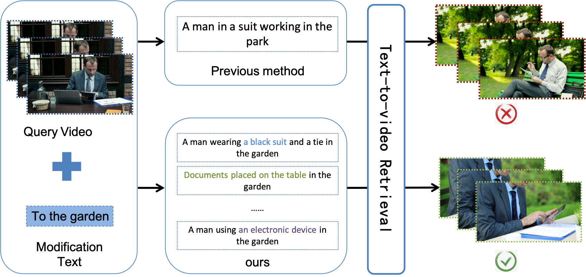
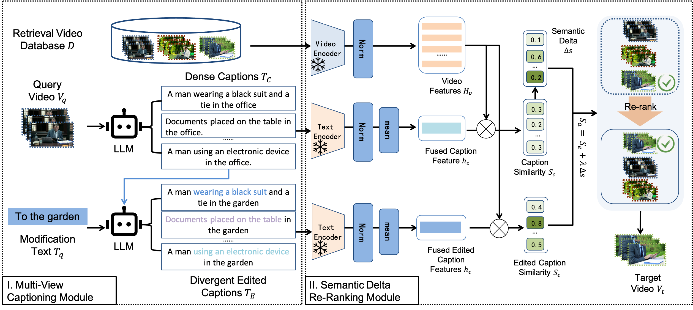

<div align="center">

# **Multi-View Captioning with Semantic Delta Re-Ranking for Zero-Shot Composed Video Retrieval**

[\[🚀 Project Homepage\]](https://yzy-bupt.github.io/MCSD/) [\[📖 Paper\]](https://icig.csig.org.cn/2025/6172/list.html)

</div>


This is the **code repository** of the paper "Multi-View Captioning with Semantic Delta Re-Ranking for Zero-Shot Composed Video Retrieval", which aims to provide a comprehensive overview of MCSD.

## News 🚀🚀🚀
- `2025.10.22`: 🎉 We've open-sourced [MCSD](https://github.com/yzy-bupt/MCSD)! Get started with composed video retrieval today!
- `2025.08.08`: 📢 Great news! Our paper has been accepted as an **oral presentation at ICIG 2025**. Check out our work and project!


## **Overview**

**Motivation: _Video content is inherently dense in semantic information._** A single caption often fails to capture the full semantics of a target video, whereas captions generated from multiple perspectives can provide more comprehensive coverage of its potential meanings.



### **Abstract**

Composed Video Retrieval (CVR) aims to retrieve video relevant to a query video while incorporating specific changes described in modification text. For Zero-Shot Composed Video Retrieval (ZS-CVR), current methods utilize vision-language models to convert the query video into a single caption, subsequently merged with modification text to generate an edited caption for retrieval. However, the modification text doesn't clearly specify which elements to preserve from the query video, leading to possible misalignment between edited caption and target video. Additionally, the final retrieval result should not be determined solely by the similarity between edited caption and candidate videos but also incorporate the semantic delta arising from the modification text. To address these issues, we propose Multi-View Captioning with Semantic Delta Re-Ranking (MCSD) method for ZS-CVR. Specifically, the Multi-View Captioning Module to generate captions covering potential semantics of the target video, the Semantic Delta Re-Ranking Module that computes the semantic delta between the original and edited captions, to adjust similarity scores and re-ranks the retrieval results. Extensive experiments on two benchmarks demonstrate that the proposed MCSD method achieves state-of-the-art performance in ZS-CVR.

## **Getting Started**
- Python 3.9+
- CUDA-enabled GPU (recommended)

### **Installation**

1. Clone the repository

```sh
# Clone the repository
git clone https://github.com/yzy-bupt/MCSD.git
cd MCSD
```

2. Install Python dependencies

```sh
# Create and activate conda environment
conda create -n MCSD -y python=3.9.20
conda activate MCSD

# Install PyTorch and dependencies
conda install -y -c pytorch pytorch=1.11.0 torchvision=0.12.0
pip install -r requirements.txt
```

### **Data Preparation**

####  WebVid-CoVR

Download the WebVid-CoVR dataset following the instructions in the [**official web**](xxx). Place the data in data/webvid-covr/.

#### **EgoCVR**

Download the EgoCVR dataset following the instructions in the [**official web**](xxx). Place the data in data/egocvr/.


## **MCSD**
To address these issues, we propose Multi-View Captioning with Semantic Delta Re-Ranking (MCSD) for ZS-CVR. Our method features:

(1) **Multi-View Captioning Module** to generate captions covering potential semantics of the target video;

(2) **Semantic Delta Re-Ranking Module** that computes the semantic delta between original and edited captions to adjust similarity scores and re-rank retrieval results.




### 1. Step 1
Extract frames from the videos in WebVid-COVR and EgoCVR
```sh
python code/tools/extract_frames.py
```
then extract the corresponding video features.
```sh
python code/tools/video_feature.py
```

### 2. Step 2
Run this script to generate diverse captions, and then 
```sh
python code/generate_captions.py
```
run this script to generate the edited captions.
```sh
python code/generate_edit_captions.py
```

### 3. Step 3
To evaluate ours method, please run the following command:
```sh
python code/retrieval_webcovr.py
python code/retrieval_egocvr_global.py
```


## **Citation**

If you find our data useful, please consider citing our work!

```BibTeX
TBC
```
